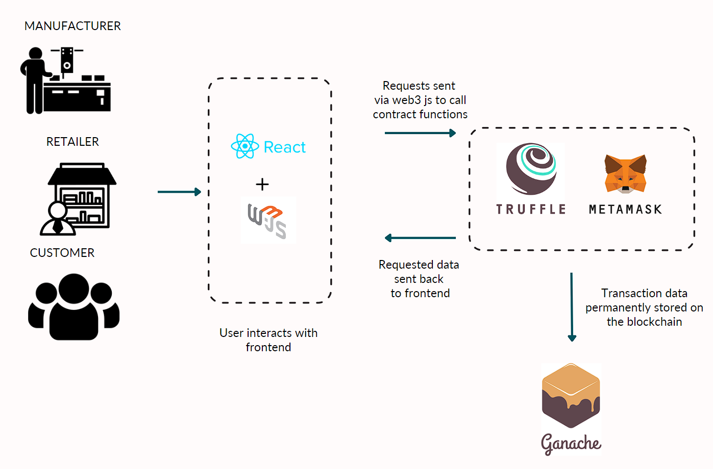
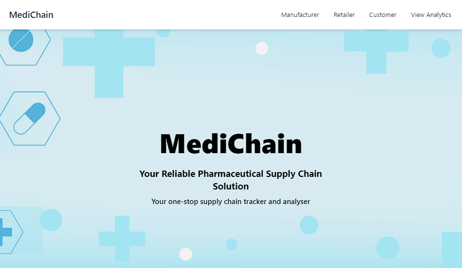
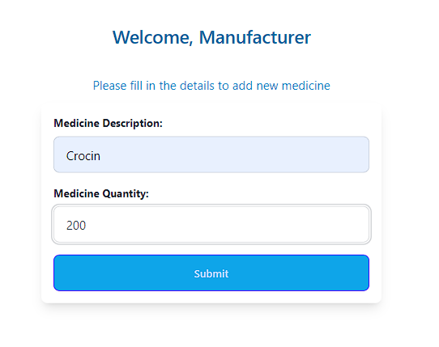
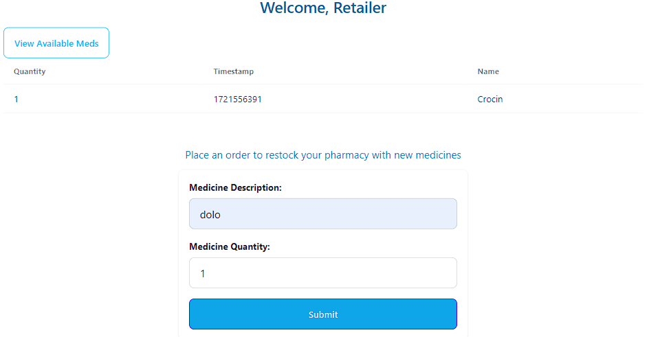
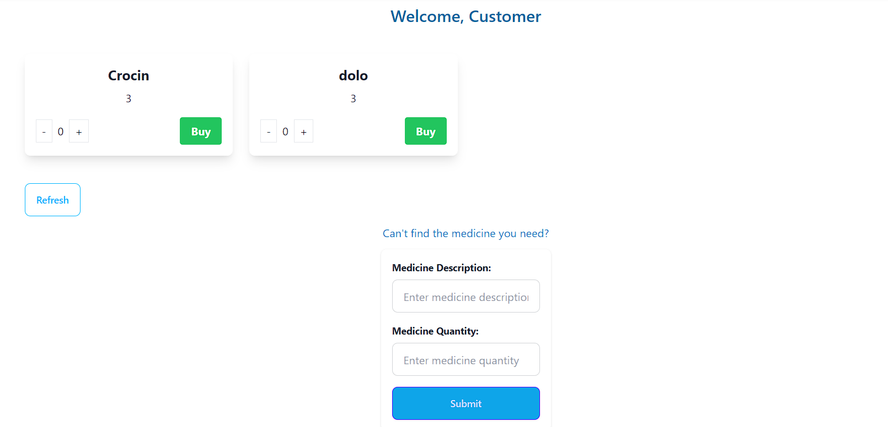
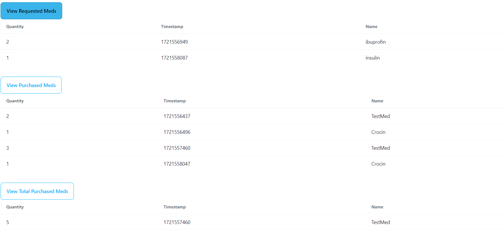

# MediChain - A blockchain based supply chain

## Table of Contents
- [Introduction](#introduction)
- [Features](#features)
- [System Architecture](#system-architecture)
- [Setup and Installation](#setup-and-installation)
- [Screenshots](#screenshots)

## Introduction
This web application provides a decentralized solution for managing the supply chain of medicines. It allows manufacturers to add new medicines, retailers to buy and view medicines, and customers to purchase medicines and raise requests for unavailable items. The application leverages blockchain technology to ensure transparency and immutability of transactions.

## Features
- **Manufacturer**:
  - Add new medicines.
  - View added medicines.
- **Retailer**:
  - View medicines available for purchase.
  - Buy new medicines.
  - View all purchased medicines.
- **Customer**:
  - View all available medicines.
  - Purchase medicines by selecting quantity.
  - Raise requests for unavailable medicines.
  - View analytics page showing transactions and requests.

## Solution Architecture


## Setup and Installation

### Prerequisites
- Node.js
- MetaMask
- React       8.3.1
- Truffle     5.11.5
- Ganache     7.9.2
- Solidity    0.8.0
- Vite        5.3.1
- tailwindcss  3.4.6
- daisyui     4.12.10
- web3        4.11.0
- react-router-dom  6.24.1
 

### Installation Steps

1. Clone the repository:
   ```bash
   git clone https://github.com/Charispinto/medichain.git
   ```

2. Connect MetaMask to Ganache:
   - Open Ganache and start a workspace by connecting it to truffle-config.js of the project. 
   - Open MetaMask and add a new network with the Ganache RPC server address(`http://127.0.0.1:7545`).
   - Ensure MetaMask is connected to the Ganache network.

3. Compile and migrate the smart contracts to the blockchain:
   ```bash
   cd contracts/migrations/
   truffle migrate
   ```

4. Install dependencies:
   ```bash
   cd client/medichain
   npm install
   ```

5. Run the development server:
   ```bash
   npm run dev
   ```

## Screenshots
### Landing Page


### Manufacturer Page


### Retailer Page


### Customer Page


### Analytics Page

